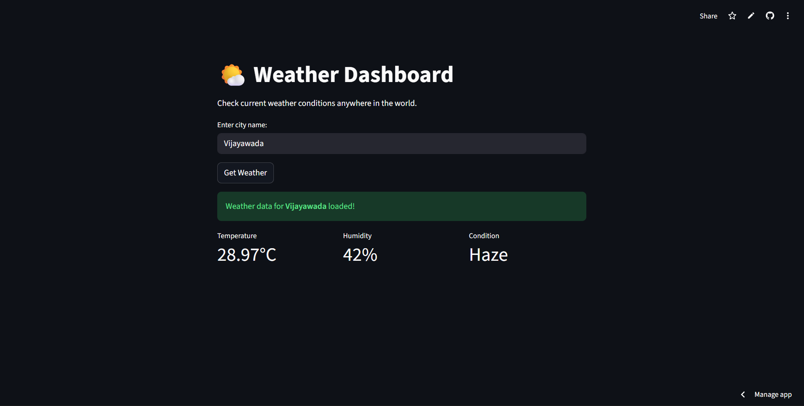

# 🌤️ Weather Dashboard

A real-time weather tracking application built with **Python** and **Streamlit**.
This dashboard fetches live data from the **OpenWeatherMap API** to display temperature, humidity, and weather conditions for any city worldwide.

[](https://weather-dashboard-victor.streamlit.app/)

---

## 🚀 Live Demo

👉 **[Click here to view the Live App](https://weather-dashboard-victor.streamlit.app/)**

---

## 🖼️ App Screenshot



👉 **[Click here to view the Live App](https://weather-dashboard-victor.streamlit.app/)**

---

## ✨ Features

* 🌍 **Global City Search** – Works for any city supported by OpenWeatherMap
* ⏱️ **Real-time Weather Data** – Temperature, humidity, and conditions
* ⚠️ **Error Handling** – Handles invalid city names and API issues gracefully
* 🎨 **Clean & Responsive UI** – Built using Streamlit
* ☁️ **Deployed Online** – Accessible from anywhere

---

## 🛠️ Tech Stack

* **Programming Language:** Python
* **Framework:** Streamlit
* **Weather API:** OpenWeatherMap
* **Deployment:** Streamlit Community Cloud

---

## 💻 Run Locally

Follow the steps below to run the project on your local machine.

### 1️⃣ Clone the Repository

```bash
git clone https://github.com/Victor-dev18/weather-dashboard.git
cd weather-dashboard
```

---

### 2️⃣ Install Dependencies

```bash
pip install -r requirements.txt
```

---

### 3️⃣ Configure API Key

This project requires an **OpenWeatherMap API key**.

1. Sign up at 👉 [https://openweathermap.org/api](https://openweathermap.org/api)
2. Create a folder named `.streamlit` in the project root
3. Inside it, create a file named `secrets.toml`
4. Add your API key:

```toml
OPENWEATHER_API_KEY = "your_actual_api_key_here"
```

> ⚠️ **Important:** Never upload `secrets.toml` to GitHub.

---

### 4️⃣ Run the Application

```bash
python -m streamlit run weather_app.py
```

---

## 📂 Project Structure

```
weather-dashboard/
├── .streamlit/
│   └── secrets.toml      # API keys (ignored by Git)
├── weather_app.py        # Main application file
├── requirements.txt      # Python dependencies
└── README.md             # Project documentation
```

---


## 🤝 Contributing

Contributions are welcome!

* Fork the repository
* Create a new branch
* Commit your changes
* Open a pull request

For major changes, please open an issue first to discuss your idea.

---

## ⭐ Acknowledgements

* [OpenWeatherMap API](https://openweathermap.org/)
* [Streamlit](https://streamlit.io/)

---

### 📌 If you like this project, don’t forget to **star ⭐ the repository!**
